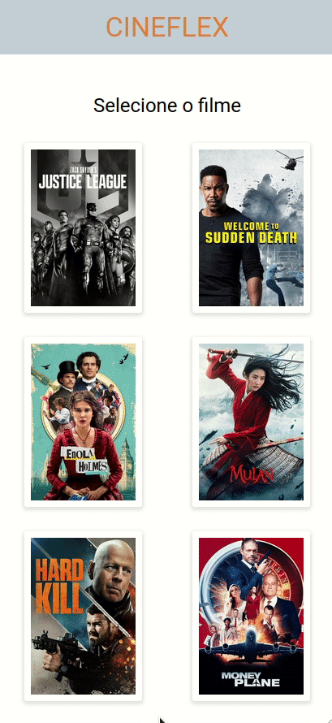

# Cineflex

Here you can book your ticket and that of your whole family to the cinema!

## Tolling

ReactJs 
Axios 

## See the result here

This application is deployed on Versel, you can visit by going to this [url](https://cineflex-5gxds1wtp-yasmimc.vercel.app/). And for a better experience, I recommend that you open in development mode and use mobile device view.

## To run locally

You must have installed node and npm.

### Available Scripts

In the project directory, you can run:

#### `npm start`

Runs the app in the development mode.\
Open [http://localhost:3000](http://localhost:3000) to view it in the browser.

The page will reload if you make edits.\
You will also see any lint errors in the console.

